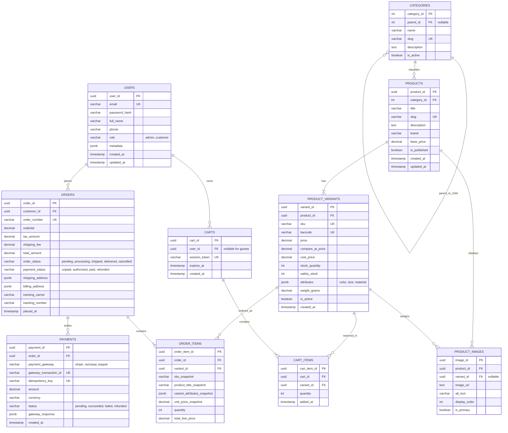
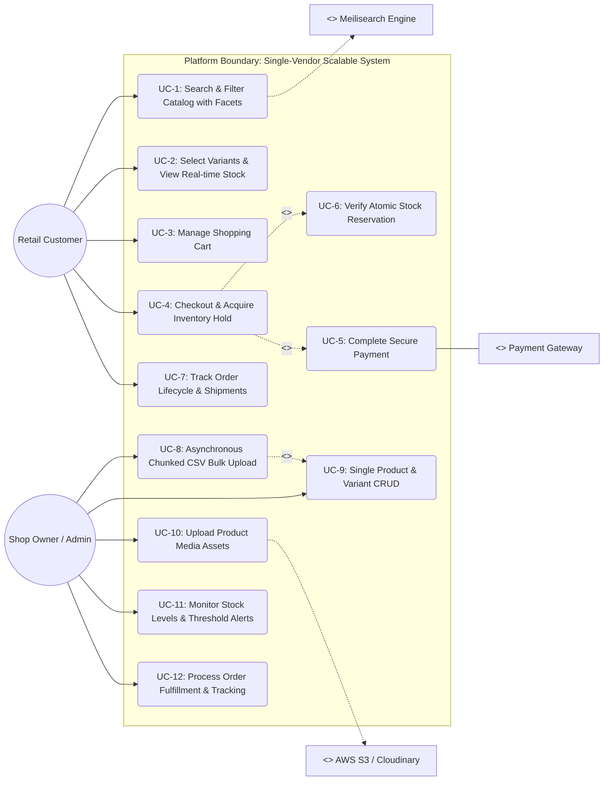
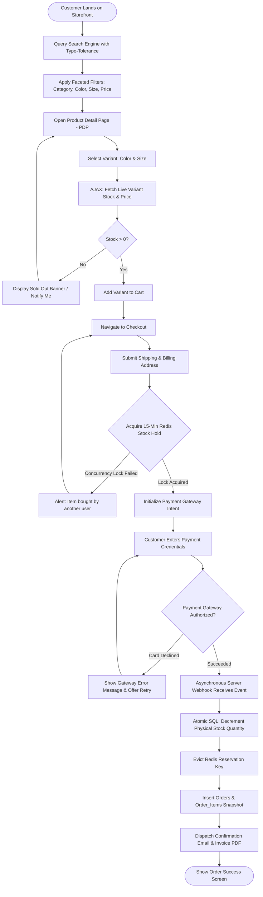
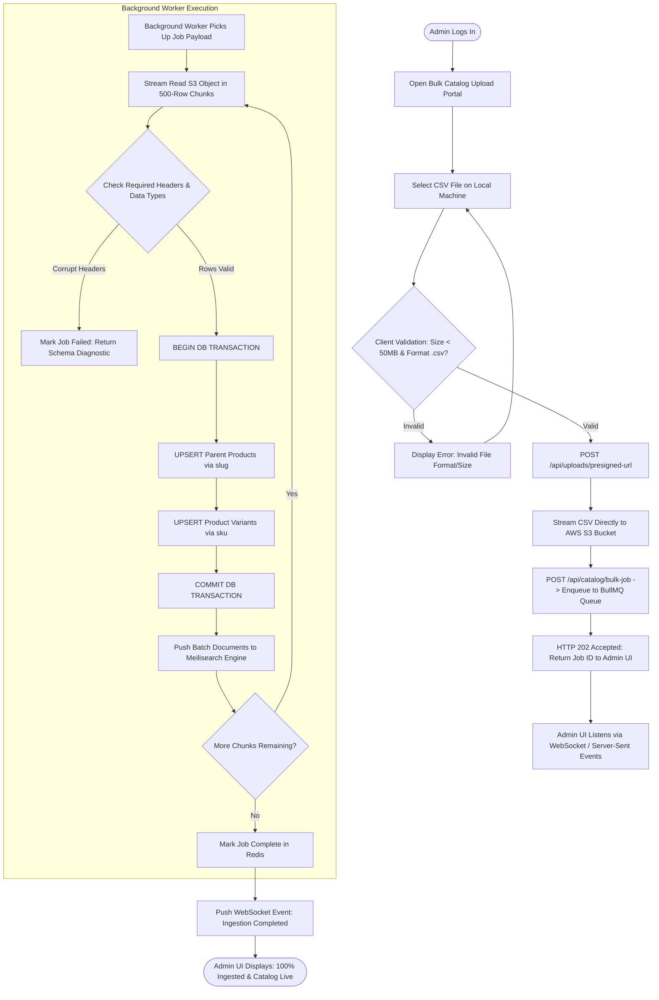
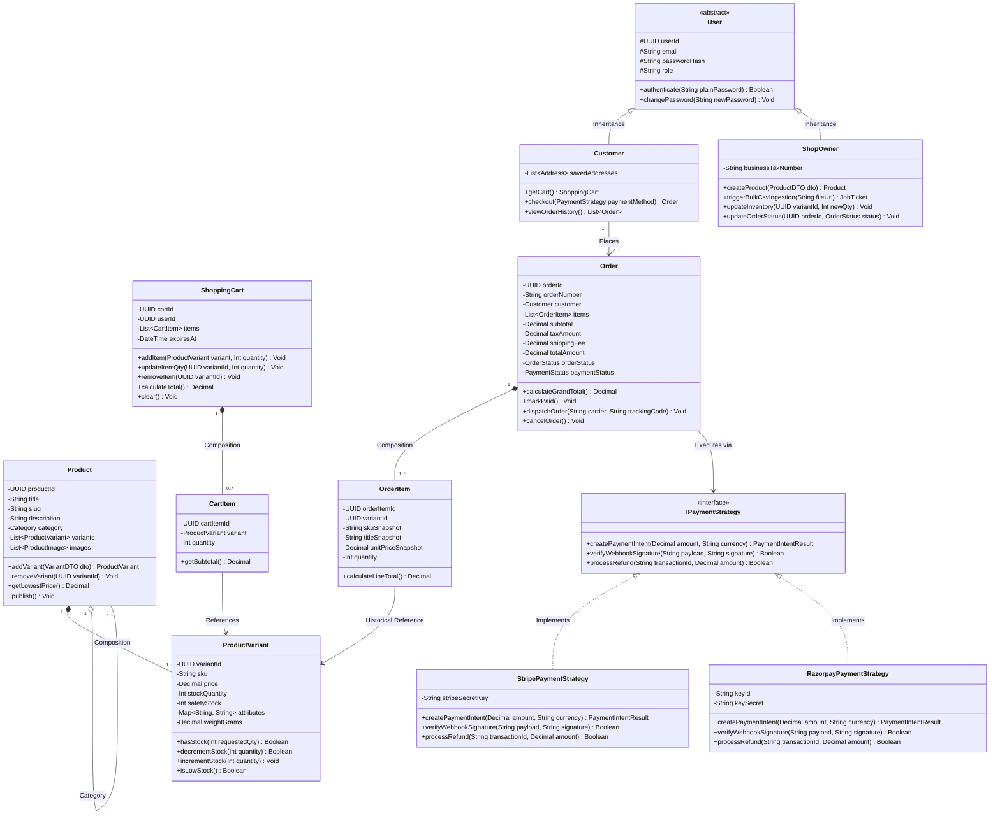
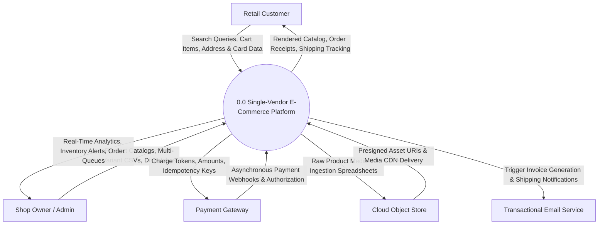
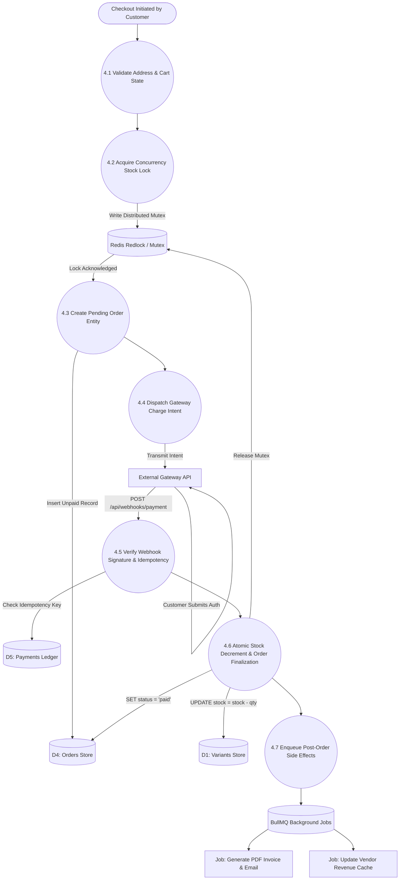

# Scalable Single-Vendor E-Commerce Platform: Enterprise Architecture Specification

This document provides an exhaustive, production-grade architectural specification for a **Single-Vendor E-Commerce Platform** engineered for long-term scalability. The architecture is intentionally designed to scale from a single shop catalog to tens of thousands of products with complex multi-attribute variants (size, color, material), faceted sub-50ms search, high-concurrency checkout locking, and asynchronous bulk data ingestion.

---

## Table of Contents
1. [Architecture Necessity & Scaling Rationale](#1-architecture-necessity--scaling-rationale)
2. [Scalable Entity-Relationship (ER) Diagram](#2-scalable-entity-relationship-er-diagram)
   - 2.1 [Mermaid ER Diagram](#21-mermaid-er-diagram)
   - 2.2 [Exhaustive Data Dictionary & Schema Constraints](#22-exhaustive-data-dictionary--schema-constraints)
   - 2.3 [Complete PostgreSQL Production DDL](#23-complete-postgresql-production-ddl)
3. [UML Use Case Diagram & Operational Specifications](#3-uml-use-case-diagram--operational-specifications)
   - 3.1 [Mermaid Use Case Diagram](#31-mermaid-use-case-diagram)
   - 3.2 [Use Case Specification Tables](#32-use-case-specification-tables)
4. [Scalable User Flowcharts](#4-scalable-user-flowcharts)
   - 4.1 [Customer Journey & Concurrency Reservation Flow](#41-customer-journey--concurrency-reservation-flow)
   - 4.2 [Shop Owner Asynchronous Chunked CSV Ingestion Flow](#42-shop-owner-asynchronous-chunked-csv-ingestion-flow)
5. [UML Class Diagram & Domain Model](#5-uml-class-diagram--domain-model)
   - 5.1 [Mermaid Class Diagram](#51-mermaid-class-diagram)
   - 5.2 [Design Patterns & OOP Architecture Applied](#52-design-patterns--oop-architecture-applied)
6. [Data Flow Diagrams (DFD)](#6-data-flow-diagrams-dfd)
   - 6.1 [Level 0 Context Diagram](#61-level-0-context-diagram)
   - 6.2 [Level 1 Decomposed System Architecture](#62-level-1-decomposed-system-architecture)
   - 6.3 [Level 2 Deep-Dive: Checkout & Order Fulfillment](#63-level-2-deep-dive-checkout--order-fulfillment)
7. [High-Concurrency, Performance & Scalability Design](#7-high-concurrency-performance--scalability-design)
   - 7.1 [The Variant & Attribute JSONB Pattern](#71-the-variant--attribute-jsonb-pattern)
   - 7.2 [Sub-50ms Faceted Search Engine Integration](#72-sub-50ms-faceted-search-engine-integration)
   - 7.3 [Atomic Inventory Reservation & Race Condition Mitigation](#73-atomic-inventory-reservation--race-condition-mitigation)
   - 7.4 [Asynchronous Worker Queue for Bulk Ingestion](#74-asynchronous-worker-queue-for-bulk-ingestion)
8. [Comprehensive Viva Defense & Production Review Guide](#8-comprehensive-viva-defense--production-review-guide)

---

## 1. Architecture Necessity & Scaling Rationale

Building a system that can scale from 10 items to 100,000+ items without requiring an entire database or architectural overhaul demands upfront structural planning. The table below details why each of these models is essential for both real-world cloud production and formal software engineering defense:

| Architectural Artifact | Production Scaling Role | Academic / Viva Defense Role | Failure Mode if Omitted |
| :--- | :--- | :--- | :--- |
| **Entity-Relationship (ER) Diagram** | Separates abstract product metadata from transactional SKUs/variants. Models historical price immutability and atomic stock counters. | Demonstrates database normalization (3NF/BCNF), relational integrity, and constraint design. | Inventory race conditions, catastrophic price corruption on past invoices, and database locking deadlocks. |
| **Use Case Diagram** | Maps role-based access control (RBAC), API authorization gateways, and third-party webhook boundaries. | Verifies requirement engineering, behavioral boundaries, and UML stereotype modeling (`<<include>>`, `<<extend>>`). | Security vulnerabilities, unauthorized administrative access, and unhandled external service edge-cases. |
| **User Flowcharts** | Blueprint for frontend routing, cache invalidation hooks, Redis cart holds, and asynchronous retry workflows. | Demonstrates understanding of conditional algorithms, asynchronous worker jobs, and failure state management. | Cart drop-offs, phantom inventory holds, unhandled payment failures, and thread starvation during CSV uploads. |
| **UML Class Diagram** | Directly guides TypeScript/Python ORM domain models, Repository design patterns, and decoupled business logic. | Proves mastery of Object-Oriented Design (OOD), SOLID principles, encapsulation, and class inheritance. | Spaghetti code, monolithic controllers, tight coupling to specific database vendors, and untestable codebases. |
| **Data Flow Diagram (DFD)** | Traces data packets, boundary crossings, message broker queues, and caching layers (L0 to L2). | Fundamental requirement for Software Development Life Cycle (SDLC) compliance and data governance evaluation. | Unidentified bottlenecks, memory leaks in backend services, and unencrypted transmission of sensitive card/PII data. |

---

## 2. Scalable Entity-Relationship (ER) Diagram

### 2.1 Mermaid ER Diagram

The schema implements the **Product-Variant Pattern**, decoupling parent display attributes from sellable Stock Keeping Units (SKUs). It separates images into a standalone asset gallery, supports hierarchical categories, implements dynamic shopping carts with expiration timestamps, preserves immutable price snapshots in order line items, and establishes an idempotent payment ledger.



---

### 2.2 Exhaustive Data Dictionary & Schema Constraints

#### Table: `USERS`
* **`user_id`** (`UUID`, Primary Key): Universally unique identifier generated via `gen_random_uuid()`. Eliminates integer enumeration attacks.
* **`email`** (`VARCHAR(255)`, Unique, Not Null): RFC-compliant user email address, normalized to lowercase via an index.
* **`password_hash`** (`VARCHAR(255)`, Not Null): Cryptographic hash generated using Argon2id or bcrypt (cost factor $\ge 12$).
* **`role`** (`VARCHAR(30)`, Default: `'customer'`): Role-Based Access Control key (`'admin'` for shop owner, `'customer'` for buyers).
* **`metadata`** (`JSONB`): Extensible profile store (e.g., notification preferences, locale, marketing flags).
* **`created_at`, `updated_at`** (`TIMESTAMP WITH TIME ZONE`): System audit trails.

#### Table: `CATEGORIES`
* **`category_id`** (`SERIAL`, Primary Key): Auto-incrementing integer identifier.
* **`parent_id`** (`INTEGER`, Nullable, Foreign Key $
ightarrow$ `CATEGORIES.category_id`): Self-referencing recursive foreign key allowing unlimited nested catalog taxonomies (e.g., *Apparel $
ightarrow$ Men $
ightarrow$ Outerwear*).
* **`slug`** (`VARCHAR(150)`, Unique, Not Null): URL-safe hyphenated identifier for routing.

#### Table: `PRODUCTS` (Parent Entity)
* **`product_id`** (`UUID`, Primary Key): Unique parent catalog identifier.
* **`category_id`** (`INTEGER`, Foreign Key $
ightarrow$ `CATEGORIES.category_id`): Categorical classification.
* **`title`** (`VARCHAR(255)`, Not Null): Marketing display name of the product.
* **`slug`** (`VARCHAR(255)`, Unique, Not Null): Canonical search-engine-friendly URI component.
* **`description`** (`TEXT`): Full HTML/Markdown marketing overview.
* **`brand`** (`VARCHAR(100)`): Manufacturing or internal vendor line.
* **`base_price`** (`NUMERIC(12,2)`, Not Null): Baseline reference display price.
* **`is_published`** (`BOOLEAN`, Default: `false`): Visibility toggle for draft state vs. public catalog view.

#### Table: `PRODUCT_VARIANTS` (Child Sellable SKU Entity)
* **`variant_id`** (`UUID`, Primary Key): Specific SKU entity identifier.
* **`product_id`** (`UUID`, Foreign Key $
ightarrow$ `PRODUCTS.product_id` on delete CASCADE): Reference to parent.
* **`sku`** (`VARCHAR(100)`, Unique, Not Null): Stock Keeping Unit string used in physical inventory warehousing.
* **`barcode`** (`VARCHAR(100)`, Unique, Nullable): UPC, EAN, or ISBN barcode for scanner integration.
* **`price`** (`NUMERIC(12,2)`, Not Null): Exact selling price for this specific size/color combination.
* **`compare_at_price`** (`NUMERIC(12,2)`, Nullable): Original MSRP for displaying sale discounts.
* **`stock_quantity`** (`INTEGER`, Not Null, Check: `stock_quantity >= 0`): Live on-shelf physical count.
* **`safety_stock`** (`INTEGER`, Default: 5): Threshold trigger for automated low-inventory alerts.
* **`attributes`** (`JSONB`, Not Null): Key-value schema holding variant permutations (e.g., `{"color": "Navy Blue", "size": "XL", "fabric": "Cotton"}`). Indexed with a GIN index.
* **`weight_grams`** (`NUMERIC(10,2)`): Weight metric used for real-time shipping rate calculations.

#### Table: `ORDERS`
* **`order_id`** (`UUID`, Primary Key): Master order identifier.
* **`order_number`** (`VARCHAR(64)`, Unique, Not Null): Human-readable tracking string (e.g., `ORD-20260906-8921`).
* **`order_status`** (`VARCHAR(32)`, Default: `'pending'`): State machine tracking: `pending` $
ightarrow$ `processing` $
ightarrow$ `shipped` $
ightarrow$ `delivered` $
ightarrow$ `cancelled`.
* **`payment_status`** (`VARCHAR(32)`, Default: `'unpaid'`): State machine tracking: `unpaid` $
ightarrow$ `authorized` $
ightarrow$ `paid` $
ightarrow$ `refunded`.
* **`shipping_address`, `billing_address`** (`JSONB`, Not Null): Immutably serialized recipient shipping and tax address payload.

#### Table: `ORDER_ITEMS`
* **`order_item_id`** (`UUID`, Primary Key): Line item record.
* **`order_id`** (`UUID`, Foreign Key $
ightarrow$ `ORDERS.order_id` on delete CASCADE): Parent order record.
* **`variant_id`** (`UUID`, Foreign Key $
ightarrow$ `PRODUCT_VARIANTS.variant_id` on delete SET NULL): Points to product variant.
* **`unit_price_snapshot`** (`NUMERIC(12,2)`, Not Null): **Historical Price Snapshot**. Freezes the exact unit cost at the second of sale. Ensures that future product price adjustments do not retroactively modify historical financial ledgers.
* **`variant_attributes_snapshot`** (`JSONB`): Freezes the color/size choices at the time of purchase in case the vendor later alters the variant structure.

#### Table: `PAYMENTS`
* **`payment_id`** (`UUID`, Primary Key): Transaction entry.
* **`gateway_transaction_id`** (`VARCHAR(255)`, Unique): External payment reference ID returned by Stripe, Razorpay, or PayPal.
* **`idempotency_key`** (`VARCHAR(255)`, Unique, Not Null): Prevents double-charging if webhooks or clients retry API calls.

---

### 2.3 Complete PostgreSQL Production DDL

```sql
-- Enable UUID extension
CREATE EXTENSION IF NOT EXISTS "uuid-ossp";

-- Table: USERS
CREATE TABLE users (
    user_id UUID PRIMARY KEY DEFAULT gen_random_uuid(),
    email VARCHAR(255) NOT NULL UNIQUE,
    password_hash VARCHAR(255) NOT NULL,
    full_name VARCHAR(150) NOT NULL,
    phone VARCHAR(30),
    role VARCHAR(30) NOT NULL DEFAULT 'customer' CHECK (role IN ('admin', 'customer')),
    metadata JSONB DEFAULT '{}'::jsonb,
    created_at TIMESTAMP WITH TIME ZONE DEFAULT CURRENT_TIMESTAMP,
    updated_at TIMESTAMP WITH TIME ZONE DEFAULT CURRENT_TIMESTAMP
);

-- Table: CATEGORIES
CREATE TABLE categories (
    category_id SERIAL PRIMARY KEY,
    parent_id INT REFERENCES categories(category_id) ON DELETE SET NULL,
    name VARCHAR(100) NOT NULL,
    slug VARCHAR(120) NOT NULL UNIQUE,
    description TEXT,
    is_active BOOLEAN NOT NULL DEFAULT true
);

-- Table: PRODUCTS
CREATE TABLE products (
    product_id UUID PRIMARY KEY DEFAULT gen_random_uuid(),
    category_id INT REFERENCES categories(category_id) ON DELETE RESTRICT,
    title VARCHAR(255) NOT NULL,
    slug VARCHAR(255) NOT NULL UNIQUE,
    description TEXT,
    brand VARCHAR(100),
    base_price NUMERIC(12, 2) NOT NULL CHECK (base_price >= 0),
    is_published BOOLEAN NOT NULL DEFAULT false,
    created_at TIMESTAMP WITH TIME ZONE DEFAULT CURRENT_TIMESTAMP,
    updated_at TIMESTAMP WITH TIME ZONE DEFAULT CURRENT_TIMESTAMP
);

-- Table: PRODUCT_VARIANTS
CREATE TABLE product_variants (
    variant_id UUID PRIMARY KEY DEFAULT gen_random_uuid(),
    product_id UUID NOT NULL REFERENCES products(product_id) ON DELETE CASCADE,
    sku VARCHAR(100) NOT NULL UNIQUE,
    barcode VARCHAR(100) UNIQUE,
    price NUMERIC(12, 2) NOT NULL CHECK (price >= 0),
    compare_at_price NUMERIC(12, 2) CHECK (compare_at_price >= price),
    cost_price NUMERIC(12, 2),
    stock_quantity INT NOT NULL DEFAULT 0 CHECK (stock_quantity >= 0),
    safety_stock INT NOT NULL DEFAULT 5,
    attributes JSONB NOT NULL DEFAULT '{}'::jsonb,
    weight_grams NUMERIC(10, 2) DEFAULT 0.00,
    is_active BOOLEAN NOT NULL DEFAULT true,
    created_at TIMESTAMP WITH TIME ZONE DEFAULT CURRENT_TIMESTAMP
);

-- GIN Index for rapid JSONB attribute queries (e.g. Find all size=XL, color=Red)
CREATE INDEX idx_product_variants_attributes ON product_variants USING GIN (attributes);
CREATE INDEX idx_products_category ON products(category_id);
CREATE INDEX idx_products_slug ON products(slug);

-- Table: PRODUCT_IMAGES
CREATE TABLE product_images (
    image_id UUID PRIMARY KEY DEFAULT gen_random_uuid(),
    product_id UUID NOT NULL REFERENCES products(product_id) ON DELETE CASCADE,
    variant_id UUID REFERENCES product_variants(variant_id) ON DELETE SET NULL,
    image_url TEXT NOT NULL,
    alt_text VARCHAR(255),
    display_order INT NOT NULL DEFAULT 0,
    is_primary BOOLEAN NOT NULL DEFAULT false
);

-- Table: CARTS & CART_ITEMS
CREATE TABLE carts (
    cart_id UUID PRIMARY KEY DEFAULT gen_random_uuid(),
    user_id UUID REFERENCES users(user_id) ON DELETE CASCADE,
    session_token VARCHAR(255) NOT NULL UNIQUE,
    expires_at TIMESTAMP WITH TIME ZONE NOT NULL,
    created_at TIMESTAMP WITH TIME ZONE DEFAULT CURRENT_TIMESTAMP
);

CREATE TABLE cart_items (
    cart_item_id UUID PRIMARY KEY DEFAULT gen_random_uuid(),
    cart_id UUID NOT NULL REFERENCES carts(cart_id) ON DELETE CASCADE,
    variant_id UUID NOT NULL REFERENCES product_variants(variant_id) ON DELETE CASCADE,
    quantity INT NOT NULL CHECK (quantity > 0),
    added_at TIMESTAMP WITH TIME ZONE DEFAULT CURRENT_TIMESTAMP,
    CONSTRAINT uq_cart_variant UNIQUE (cart_id, variant_id)
);

-- Table: ORDERS
CREATE TABLE orders (
    order_id UUID PRIMARY KEY DEFAULT gen_random_uuid(),
    customer_id UUID REFERENCES users(user_id) ON DELETE RESTRICT,
    order_number VARCHAR(64) NOT NULL UNIQUE,
    subtotal NUMERIC(12, 2) NOT NULL CHECK (subtotal >= 0),
    tax_amount NUMERIC(12, 2) NOT NULL DEFAULT 0.00,
    shipping_fee NUMERIC(12, 2) NOT NULL DEFAULT 0.00,
    total_amount NUMERIC(12, 2) NOT NULL CHECK (total_amount >= 0),
    order_status VARCHAR(32) NOT NULL DEFAULT 'pending' 
        CHECK (order_status IN ('pending', 'processing', 'shipped', 'delivered', 'cancelled')),
    payment_status VARCHAR(32) NOT NULL DEFAULT 'unpaid' 
        CHECK (payment_status IN ('unpaid', 'authorized', 'paid', 'refunded')),
    shipping_address JSONB NOT NULL,
    billing_address JSONB NOT NULL,
    tracking_carrier VARCHAR(100),
    tracking_number VARCHAR(150),
    placed_at TIMESTAMP WITH TIME ZONE DEFAULT CURRENT_TIMESTAMP
);

-- Table: ORDER_ITEMS (Snapshots Price and Spec)
CREATE TABLE order_items (
    order_item_id UUID PRIMARY KEY DEFAULT gen_random_uuid(),
    order_id UUID NOT NULL REFERENCES orders(order_id) ON DELETE CASCADE,
    variant_id UUID REFERENCES product_variants(variant_id) ON DELETE SET NULL,
    sku_snapshot VARCHAR(100) NOT NULL,
    product_title_snapshot VARCHAR(255) NOT NULL,
    variant_attributes_snapshot JSONB NOT NULL DEFAULT '{}'::jsonb,
    unit_price_snapshot NUMERIC(12, 2) NOT NULL CHECK (unit_price_snapshot >= 0),
    quantity INT NOT NULL CHECK (quantity > 0),
    total_line_price NUMERIC(12, 2) NOT NULL CHECK (total_line_price >= 0)
);

-- Table: PAYMENTS
CREATE TABLE payments (
    payment_id UUID PRIMARY KEY DEFAULT gen_random_uuid(),
    order_id UUID NOT NULL REFERENCES orders(order_id) ON DELETE RESTRICT,
    payment_gateway VARCHAR(50) NOT NULL,
    gateway_transaction_id VARCHAR(255) NOT NULL UNIQUE,
    idempotency_key VARCHAR(255) NOT NULL UNIQUE,
    amount NUMERIC(12, 2) NOT NULL CHECK (amount >= 0),
    currency VARCHAR(10) NOT NULL DEFAULT 'USD',
    status VARCHAR(32) NOT NULL CHECK (status IN ('pending', 'succeeded', 'failed', 'refunded')),
    gateway_response JSONB DEFAULT '{}'::jsonb,
    created_at TIMESTAMP WITH TIME ZONE DEFAULT CURRENT_TIMESTAMP
);
```

---

## 3. UML Use Case Diagram & Operational Specifications

### 3.1 Mermaid Use Case Diagram



---

### 3.2 Use Case Specification Tables

#### Use Case: UC-8 — Asynchronous Chunked CSV Bulk Upload
* **Actor:** Shop Owner / Admin
* **Pre-conditions:** Shop Owner is authenticated with an `admin` JWT; CSV file follows the platform's multi-variant header format.
* **Main Success Scenario:**
  1. Admin selects a multi-megabyte CSV containing 5,000 product variants.
  2. The system generates an S3 Presigned URL; the client uploads the raw file directly to cloud storage.
  3. The backend enqueues a background job payload with file metadata to Redis BullMQ.
  4. Worker processes download the file, parse it in chunks of 500 rows, and validate SKU uniqueness and positive pricing.
  5. The worker batch-inserts records into `products` and `product_variants` within an isolated database transaction.
  6. The worker emits update payloads to Meilisearch to synchronize the search index.
  7. A WebSocket notification fires to the Admin Dashboard: *"5,000 variants successfully ingested in 4.2 seconds."*
* **Exception Scenario (Invalid Data):**
  - If row 412 has a malformed price or negative stock, the transaction for that chunk rolls back, and a CSV error report is compiled listing the exact invalid lines.

#### Use Case: UC-4 — Checkout & Acquire Inventory Hold
* **Actor:** Retail Customer
* **Pre-conditions:** Customer has items in their active cart; shipping address has been submitted.
* **Main Success Scenario:**
  1. Customer clicks *"Proceed to Payment"*.
  2. System initiates an atomic check via Redis distributed locking or PostgreSQL `FOR UPDATE`.
  3. Sufficient stock is confirmed; a temporary 15-minute reservation hold is acquired.
  4. The system calculates subtotal, tax, and shipping fees, producing a unified payment intent.
  5. Payment gateway SDK mounts the card elements.
* **Extension: UC-6 (Stock Depleted):**
  - If another customer completed payment milliseconds earlier, the transaction reports insufficient inventory, releases any partial locks, and updates the cart UI with real-time stock levels.

---

## 4. Scalable User Flowcharts

### 4.1 Customer Journey & Concurrency Reservation Flow

This flowchart models the customer checkout path, highlighting how the system manages variant selection, dynamic pricing updates, and inventory holds to prevent overselling.



---

### 4.2 Shop Owner Asynchronous Chunked CSV Ingestion Flow

This flowchart models how the platform ingests large catalogs without blocking web servers or causing HTTP request timeouts.



---

## 5. UML Class Diagram & Domain Model

### 5.1 Mermaid Class Diagram

This class diagram details the domain layer, highlighting encapsulation (`-` private, `#` protected, `+` public), design patterns (Repository Pattern, Strategy Pattern for multi-gateway payments), and object relationships.



---

### 5.2 Design Patterns & OOP Architecture Applied

1. **Strategy Pattern for Payments (`IPaymentStrategy`):**
   * Decouples checkout orchestration from payment vendor SDKs.
   * Enables toggling between payment providers (Stripe, Razorpay, PayPal) or routing transactions based on the customer's currency without modifying the core `Order` or `Checkout` services.
2. **Composition over Inheritance (`Product` $
ightarrow$ `ProductVariant`):**
   * Avoids fragile class hierarchies (e.g., `Shirt` extending `Clothing` extending `Product`).
   * Models complex variations through structured data (`Map<String, String>` attributes) attached to sellable variants, making it easy to support any product category dynamically.
3. **Immutability via Value Snapshots (`OrderItem`):**
   * Preserves historical price points and product names directly on order line items to prevent past records from changing when live catalog details are updated.

---

## 6. Data Flow Diagrams (DFD)

### 6.1 Level 0 Context Diagram

The Level 0 Context Diagram isolates the single-vendor e-commerce platform as a single operational boundary, mapping the inputs and outputs exchanged with external entities.



---

### 6.2 Level 1 Decomposed System Architecture

Level 1 decomposes process `0.0` into functional subsystems, identifying data exchanges across persistent stores (`D1` through `D5`).

```mermaid
graph TD
    Vendor[Shop Owner / Admin]
    Cust[Customer]
    Gate[Payment Gateway]

    P1((1.0 Ingest & Manage Catalog))
    P2((2.0 Index & Search Engine))
    P3((3.0 Manage Cart & Reservations))
    P4((4.0 Process Checkout & Payments))
    P5((5.0 Order Fulfillment & Tracking))

    D1[[(D1) Products & Variants Store]]
    D2[[(D2) Search Engine Index]]
    D3[[(D3) Redis Distributed Carts & Holds]]
    D4[[(D4) Orders & Order_Items Store]]
    D5[[(D5) Payments Ledger Store]]

    Vendor -->|CSV Files & Single Forms| P1
    P1 -->|Write Relational Data| D1
    P1 -->|Dispatch Sync Events| P2
    P2 -->|Update Inverted Indices| D2

    Cust -->|Faceted Search Queries| P2
    D2 -->|Sub-50ms Search Results| Cust

    Cust -->|Add to Cart / Select Variants| P3
    D1 -->|Validate Stock Availability| P3
    P3 -->|Store Active Sessions & TTL Holds| D3

    Cust -->|Submit Checkout & Payment| P4
    D3 -->|Verify & Consume Reservation Hold| P4
    P4 -->|Deduct Physical Stock| D1
    P4 -->|Create Pending Order Record| D4
    P4 -->|Initiate Charge Intent| Gate
    Gate -->|Webhook: Charge Successful| P4
    P4 -->|Log Immutable Transaction| D5
    P4 -->|Transition Status: Paid| D4

    Vendor -->|Fetch Unfulfilled Orders| P5
    D4 -->|Stream Paid Orders| P5
    Vendor -->|Input Carrier Tracking Number| P5
    P5 -->|Update Order Status: Shipped| D4
    P5 -->|Dispatch Tracking Email| Cust
```

---

### 6.3 Level 2 Deep-Dive: Checkout & Order Fulfillment

Level 2 breaks down process `4.0` (*Process Checkout & Payments*) into granular subroutines to show how transactions and inventory states are handled safely.



---

## 7. High-Concurrency, Performance & Scalability Design

### 7.1 The Variant & Attribute JSONB Pattern

Standard relational models often use separate tables for attributes (e.g., `products`, `attributes`, `attribute_values`, `product_attribute_associations`). While strictly normalized, joining across four tables to filter a catalog of 50,000 items can significantly slow down database reads.

This design implements the **PostgreSQL Hybrid JSONB Pattern**:
* Global attributes that drive inventory tracking are stored on `product_variants.attributes` as key-value pairs:
  ```json
  {
    "color": "Midnight Blue",
    "size": "XXL",
    "material": "Merino Wool",
    "gender": "Unisex"
  }
  ```
* Accelerated via a **PostgreSQL GIN (Generalized Inverted Index)**:
  ```sql
  CREATE INDEX idx_variants_attrs ON product_variants USING GIN (attributes);
  ```
* Allows querying arbitrary attribute combinations with low query latency:
  ```sql
  SELECT * FROM product_variants 
  WHERE attributes @> '{"color": "Midnight Blue", "size": "XXL"}';
  ```

---

### 7.2 Sub-50ms Faceted Search Engine Integration

Running SQL `LIKE` or `%ILIKE%` wildcards over tens of thousands of products can lead to high database CPU utilization and table scans. 

**Production Integration Pattern:**
1. **Primary Source of Truth:** PostgreSQL handles transactional consistency and writes.
2. **Read-Optimized Search Engine:** A dedicated search engine (**Meilisearch** or **Typesense**) handles catalog browsing, typo-tolerance, and faceted queries.
3. **Synchronization Pipeline:**
   * When an Admin saves a product or imports a CSV, an application event triggers (`ProductSavedEvent`).
   * A background worker flattens the product and variant records into a search document:
     ```json
     {
       "id": "prod_872134",
       "title": "Vintage Washed Cotton Tee",
       "brand": "Heritage Studio",
       "category": "Apparel > Tops",
       "min_price": 28.00,
       "max_price": 32.00,
       "colors": ["Black", "Faded Olive"],
       "sizes": ["S", "M", "L", "XL"],
       "in_stock": true,
       "created_at": 1725580800
     }
     ```
   * Frontend clients query the search cluster directly, keeping response times under 50ms and offloading read traffic from the main database.

---

### 7.3 Atomic Inventory Reservation & Race Condition Mitigation

A common issue in high-traffic e-commerce is the **race condition oversell**, where two users purchase the final unit of stock simultaneously.

#### Anti-Pattern (Vulnerable to Overselling):
```typescript
// BAD: Application-level check
const variant = await db.variants.findById(variantId);
if (variant.stock >= requestedQty) {
  // Concurrency vulnerability: Another process can execute here
  await db.variants.update(variantId, { stock: variant.stock - requestedQty });
}
```

#### Production Solution 1: Atomic Database Updates
```sql
-- Single atomic operation: Updates only if sufficient stock exists
UPDATE product_variants
SET stock_quantity = stock_quantity - :requestedQty
WHERE variant_id = :variantId AND stock_quantity >= :requestedQty;
```
If the affected row count is `0`, the product is out of stock; the application rolls back the checkout immediately.

#### Production Solution 2: Distributed Cart Holds via Redis
* When a customer advances to checkout, a temporary key with a 15-minute Time-To-Live (TTL) is created in Redis:
  ```text
  SET stock_hold:variant_uuid:customer_uuid 2 EX 900 NX
  ```
* If payment completes within 15 minutes, the hold converts to an atomic database decrement.
* If the user abandons checkout or the timer expires, Redis evicts the key automatically, returning the inventory to the public catalog without manual database rollbacks.

---

### 7.4 Asynchronous Worker Queue for Bulk Ingestion

Synchronous CSV processing over a standard HTTP request will trigger a connection timeout on large catalogs (e.g., 20,000 rows).

**Production Architecture Pattern:**
* **File Upload:** The client requests an S3 Presigned POST URL, uploading the raw CSV directly to cloud storage without traversing the backend application servers.
* **Job Enqueue:** The backend places a job payload on a Redis-backed queue (**BullMQ** for Node.js or **Celery** for Python):
  ```json
  {
    "jobId": "job_csv_98213",
    "vendorId": "usr_admin_01",
    "s3Key": "imports/catalog_2026_09_06.csv",
    "timestamp": 1725580800
  }
  ```
* **Streaming Chunks:** Worker processes stream the file from S3, processing in batches of 500 records inside an isolated database transaction.
* **UI Updates:** The Admin Dashboard tracks progress via WebSocket updates:
  $$	ext{Progress \%} = \left(rac{	ext{Processed Rows}}{	ext{Total Rows}}
ight) 	imes 100$$

---

## 8. Comprehensive Viva Defense & Production Review Guide

### Core Architectural Defense Questions

#### 1. Why build a Single-Vendor architecture instead of a Multi-Vendor marketplace?
* **Answer:** Single-vendor systems eliminate the operational overhead of multi-party financial reconciliation, escrow settlement holds, commission fees, and split-order shipping fulfillment. This allows the backend to focus on optimized catalog hierarchies, low checkout latency, and targeted branding for one dedicated business.

#### 2. Why store variant attributes in JSONB instead of an EAV (Entity-Attribute-Value) schema?
* **Answer:** EAV schemas require joining 4 to 6 relational tables for each product lookup, which degrades query performance as catalogs grow. PostgreSQL `JSONB` stores semi-structured variant data in a decomposed binary format, and GIN indexing allows querying nested attributes in single-digit milliseconds without schema migrations for new product properties.

#### 3. How do you ensure historical price integrity if the vendor changes a product's price?
* **Answer:** Through the **Historical Snapshot Pattern**. The `order_items` table maintains a dedicated `unit_price_snapshot` column populated at the exact second of purchase. The application references this static snapshot for order receipts, customer history, and tax calculations rather than querying current values in `product_variants`.

#### 4. How does the architecture prevent double-charging on network timeouts?
* **Answer:** By using **Idempotency Keys**. The client generates a unique UUID for each checkout attempt and includes it in the `Idempotency-Key` header sent to the payment gateway. If a network drop causes the customer to click "Pay" twice, the gateway recognizes the duplicate key and returns the existing authorization response instead of executing a second charge.

#### 5. Why separate the search engine from the relational database?
* **Answer:** Relational databases are optimized for transactional integrity (ACID) and row-level safety, not fuzzy text analysis. Dedicated search engines use **inverted indexes**, phonetic matching, and tokenization algorithms, providing typo-tolerant search results across tens of thousands of items with sub-50ms response times while offloading read traffic from the primary database.

---

## 9. Technology Implementation Matrix

| Tier | Production Tool / Framework | Architectural Function |
| :--- | :--- | :--- |
| **Frontend Framework** | Next.js (React Server Components) | Delivers SSR/SSG product pages for SEO optimization while preserving dynamic client-side shopping cart state. |
| **Styling & UI Components** | Tailwind CSS + Radix UI | Provides accessible, lightweight component primitives without JavaScript bundle bloat. |
| **API & Worker Layer** | Node.js (NestJS / Express) or Python FastAPI | Modular service architecture with native stream parsers for high-throughput webhook handling and CSV processing. |
| **Relational Database** | PostgreSQL 16+ | ACID-compliant storage with row-level locking (`FOR UPDATE`) and GIN indexes for JSONB variant data. |
| **Distributed Cache & Queue** | Redis + BullMQ | Handles temporary cart reservations, user sessions, distributed mutex locking, and background task queues. |
| **Dedicated Search Engine** | Meilisearch or Typesense | Typo-tolerant, faceted search cluster providing sub-50ms responses for large product catalogs. |
| **Asset Storage & CDN** | AWS S3 + Cloudflare CDN | Object storage with globally edge-cached image delivery, dynamic WebP/AVIF transformations, and presigned upload support. |
| **Payment Integration** | Stripe Elements + Webhooks | PCI-DSS compliant checkout workflow featuring asynchronous cryptographic webhook signature validation. |
